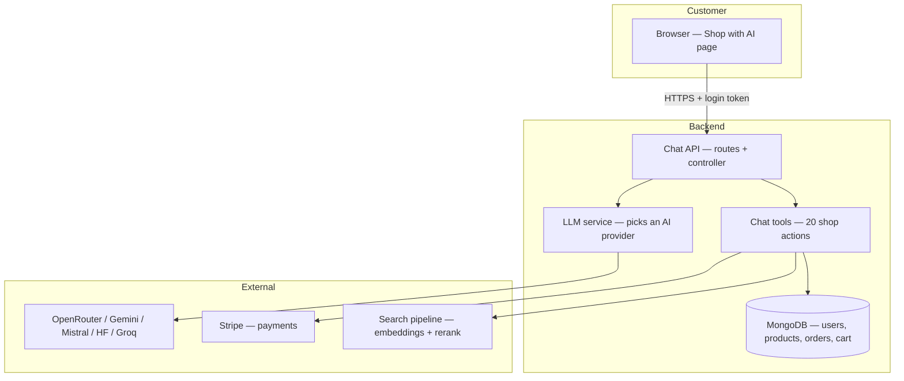
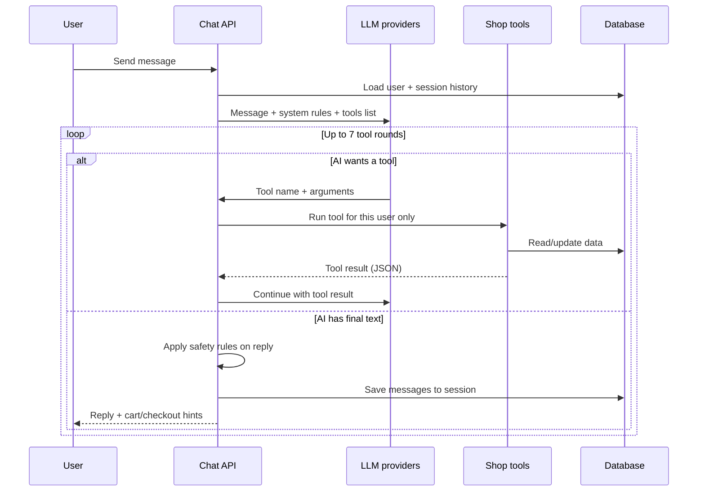

# ShopAI Chatbot — How It Works

This document explains the **AI shopping assistant** built into ShopAI: what it is, how it is structured, and which services it uses. It is written so that **non-technical readers** can follow the ideas; technical file names are included at the end for developers.

---

## What is the chatbot?

The chatbot is a **digital shopping helper** inside the ShopAI website. When a customer is logged in, they can open **“Shop with AI”** and ask questions in plain language, for example:

- “Show me cricket bats under ₹5000”
- “Where is my order?”
- “Add the blue jersey to my cart”
- “I want to checkout”

The chatbot does **not** guess store data from memory. When it needs facts (orders, products, cart, coupons), it **calls internal tools** that read or update the real database—similar to a shop assistant who checks the system before answering.

---

## Key ideas (simple definitions)

| Term | Meaning in ShopAI |
|------|-------------------|
| **LLM** (Large Language Model) | An AI service that reads messages and writes replies in natural language. |
| **Tool / function calling** | The AI can request an action (“search products”, “get my orders”) instead of inventing answers. |
| **System prompt** | Hidden instructions that define the assistant’s personality, limits, and safety rules. |
| **Session** | A saved conversation in the database so the customer can return later. |
| **Client actions** | Extra signals to the website (e.g. refresh the cart or open Stripe checkout). |

---

## High-level architecture

Think of four layers:



1. **Customer** sends a message from the frontend.  
2. **Chat API** validates login, loads conversation history, and builds the message list.  
3. **LLM** decides whether to reply in text or call a **tool**.  
4. **Tools** run real shop logic (search, cart, orders, checkout).  
5. **Response** goes back as JSON: reply text + optional cart/checkout hints.

There is **no live streaming** today: the server waits until the full answer is ready, then sends one JSON response.

---

## Conversation flow (step by step)



**Important rules enforced after the AI responds:**

- Product lists from search must match **exactly** what the search tool returned (names, prices, links).
- If the user says “yes” right after a checkout offer, the server can **confirm checkout** without relying on vague AI wording.
- Off-topic questions (weather, homework, etc.) are refused by the system instructions.

---

## Two phases, one pipeline

There is **one LLM path** (LangGraph). A second layer is **not** another chatbot — it is deterministic, rule-based code that runs **after** the agent when tools were skipped or incomplete.

| Phase | Module | What it does |
|-------|--------|----------------|
| **1. LangGraph** | `services/chatGraph/` | Guard → route intent → agent with tools (up to 7 rounds) → format reply |
| **2. Deterministic assist** | `services/chatDeterministicAssist.js` | Cart variant matching, multi-item queue, free-form address parsing, checkout/address picker when the model did not call tools |

Disable phase 2 for LangGraph-only behavior:

```env
ENABLE_CHAT_DETERMINISTIC_ASSIST=false
```

Keep it **enabled** in production unless you are debugging agent tool-calling — it covers edge cases like “2 red shirts XL”, bulk “add bat and ball”, pasted addresses, and “yes” after a checkout prompt.

---

## What can the chatbot do? (Tools)

The assistant has **20 tools**, grouped by topic:

| Area | What the customer can do (via tools) |
|------|--------------------------------------|
| **Orders** | List orders, order details, cancel/return status, cancel order, submit return |
| **Catalog** | Search products, product details, list categories and brands |
| **Promotions** | See active coupons |
| **Addresses** | List, add, update shipping addresses |
| **Cart & checkout** | View cart, add/update items, apply/remove coupon, preview checkout, create Stripe payment session |

**Product search inside chat** uses the same **hybrid search** as the website search box (keywords + meaning-based search + reranking). See [Searchbox.md](./Searchbox.md).

---

## LLM providers (who writes the words?)

ShopAI does not depend on a single AI company. The **LLM service** tries providers in order until one succeeds:

1. **OpenRouter** (primary — many models through one API)  
2. **Google Gemini**  
3. **Mistral**  
4. **Hugging Face Inference Router**  
5. **Groq**

If one provider is down, rate-limited, or missing an API key, the next one is used automatically.

The customer always sees **“ShopAI”** — internal model names are not exposed in the UI.

---

## Sessions and history

All chat turns are stored in MongoDB (`ChatSession`). The server loads and trims history from the session — **client-supplied `history` is not accepted** (prevents prompt injection and duplicate trimming).

| Request | Behavior |
|---------|----------|
| **`sessionId` provided** | Loads that conversation for the logged-in user. |
| **No `sessionId`** | Creates a new session automatically (used by the compact widget on first message). The response includes `sessionId` for follow-up turns. |

Creating a session adds a **welcome message** from the assistant so the UI is never empty. The full-screen assistant page creates sessions via `POST /chat/sessions` and always sends `sessionId`.

### Scaling and sharding (MongoDB)

At normal ShopAI scale, a single MongoDB deployment is sufficient. If you plan **horizontal sharding** later, be aware of how sessions are indexed and queried:

| Topic | Detail |
|-------|--------|
| **Current index** | `{ user: 1, updatedAt: -1 }` on `chatsessions` — fast “my conversations” list |
| **Primary access patterns** | List by `user` (session list); load/update/delete by session `_id` + `user` (message turns) |
| **Shard key risk** | Sharding on `user` co-locates every session for one account on the same shard (hot spot for power users / flash traffic) |
| **Recommended shard key** | `{ _id: 1 }` — each session document’s `_id` is the `sessionId` exposed in API responses; ObjectIds spread writes evenly |
| **Trade-off** | `GET /sessions` (list by user) may require scatter-gather across shards; keep result sets small (already capped per user) |
| **Action today** | No change required — document and revisit when moving to a sharded cluster |

Example (Atlas / mongosh — only when sharding is enabled):

```javascript
sh.shardCollection('ShopAI.chatsessions', { _id: 1 })
```

Keep the `{ user: 1, updatedAt: -1 }` index for list queries regardless of shard key.

---

## API endpoints (for developers)

All routes require a **logged-in user** (JWT). Base path: `/shopai/chat/`

| Method | Path | Purpose |
|--------|------|---------|
| `GET` | `/sessions` | List conversations |
| `POST` | `/sessions` | Start new conversation |
| `GET` | `/sessions/:id` | Load newest messages (20 by default) |
| `GET` | `/sessions/:id/messages?before=N` | Load older messages (`before` = `loadedFromEnd` from prior response) |
| `DELETE` | `/sessions/:id` | Delete conversation |
| `POST` | `/message` | Send a message and get a reply |

**Rate limiting:** by default about **15 messages per minute** per user (configurable).

---

## Response to the frontend

A successful chat message returns JSON including:

- **`reply`** — markdown text for the chat bubble  
- **`clientActions`** — e.g. `sync_cart`, `open_checkout` with Stripe URL  
- **`cartSummary`** — item count and total when relevant  
- **`checkout`** — order id, checkout URL after payment session creation  
- **`sessionId`** / **`sessionTitle`** — when using saved sessions  

---

## Configuration (environment variables)

Set these in `Backend/.env` (see `.env.example` for the full list):

| Variable | Role |
|----------|------|
| `OPENROUTER_API_KEY`, `OPENROUTER_MODEL` | Primary chat AI |
| `GEMINI_API_KEY`, `GEMINI_MODEL` | Backup chat AI |
| `MISTRAL_API_KEY`, `MISTRAL_MODEL` | Backup chat AI |
| `HUGGINGFACE_API_KEY`, `HUGGINGFACE_MODEL` | Backup chat AI |
| `JWT_KEY` | Must be set — chat is login-only |
| `MONGO_URL` | Database for sessions and shop data |
| `STRIPE_KEY` | Checkout tool |
| `FRONTEND_URL` | Allowed origin + OpenRouter referrer |
| `RATE_LIMIT_CHAT_WINDOW_MS`, `RATE_LIMIT_CHAT_MAX` | Abuse protection |

Search-related keys (`EMBEDDING_*`, `RERANK_*`, etc.) affect the **search_products** tool; see [Searchbox.md](./Searchbox.md).

---

## Main code files

| File | Role |
|------|------|
| `routes/chatRouter.js` | URL definitions |
| `controllers/chatCtrl.js` | Main loop, system prompt, reply rules |
| `controllers/chatSessionCtrl.js` | Session CRUD |
| `services/llmService.js` | Multi-provider AI client |
| `services/chatTools.js` | Tool definitions + execution |
| `services/chatSessionService.js` | Save/load conversations |
| `model/ChatSession.js` | Session schema |
| `validations/chatSchemas.js` | Request validation |
| `services/search/searchService.js` | Product search for chat |

---

## Related documentation

- [Searchbox.md](./Searchbox.md) — how product search and embeddings work  
- [ProductTagging.md](./ProductTagging.md) — how products get AI tags used in search  
- [CommentTagging.md](./CommentTagging.md) — how reviews are moderated and tagged  
