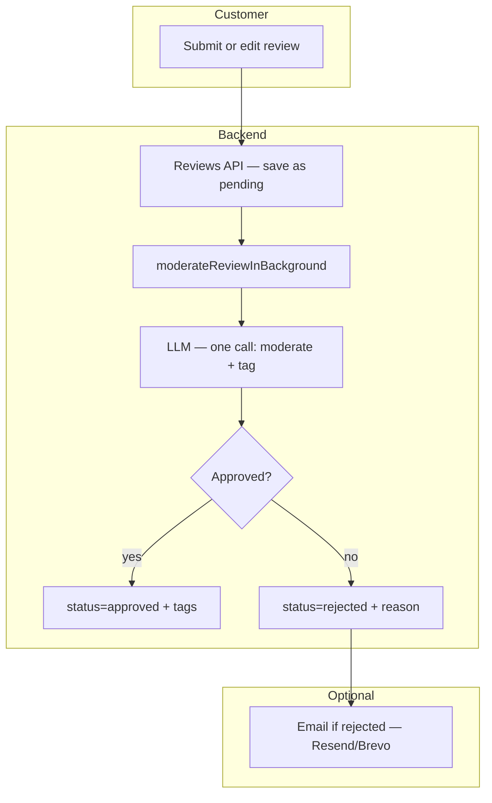
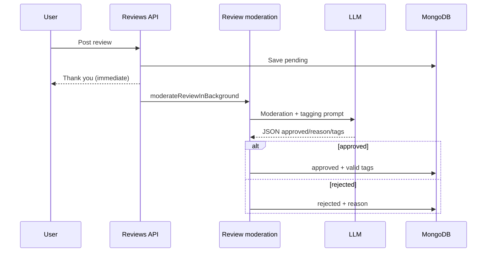

# ShopAI Review Comment Tagging & Moderation — How It Works

In ShopAI, customer **reviews** (comments on products) go through **AI moderation** and, if approved, receive **standardized tags**. This document explains that system in plain language. (We call it “comment tagging” because reviews are text comments left by shoppers.)

---

## What is comment tagging?

When a customer submits a **product review** (star rating + written message):

1. The review is saved immediately with status **`pending`**.  
2. In the background, an **AI moderator** reads the text.  
3. If the review is **safe and allowed**, it is marked **`approved`** and given one or more **tags** from a fixed list (e.g. “Good quality”, “Would recommend”).  
4. If the review breaks the rules, it is marked **`rejected`** with a **reason**; tags are cleared.

So “comment tagging” here means: **moderation first**, then **labels** only for approved reviews—not free-form keywords like product tags.

---

## Why do we need this?

| Goal | How AI helps |
|------|----------------|
| **Trust & safety** | Block hate speech, spam links, personal data (phone, email), or malicious code-like text. |
| **Consistent labels** | Tags come from one approved list so filters and analytics stay comparable. |
| **Admin efficiency** | Most reviews are classified without a human reading every line first. |

---

## Key ideas (simple definitions)

| Term | Meaning |
|------|---------|
| **Review / comment** | Stored in MongoDB as `Review` — fields include `message`, `rating`, `tags`, `moderationStatus`. |
| **Moderation** | Approve or reject the text before it is treated as published. |
| **Pending** | Waiting for AI (or failure fallback). |
| **Approved** | Safe; tags may be attached. |
| **Rejected** | Not shown as a trusted review; reason stored for support/email. |
| **VALID_TAGS** | Exactly 16 allowed tag strings—the AI cannot invent new tag names. |

---

## High-level architecture



---

## Step-by-step flow

### 1. Customer posts a review

- Routes in `controllers/reviewsCtrl.js` (create on product, or update existing review).  
- New/updated review: `moderationStatus = 'pending'`, `tags = []` (or cleared on edit).

### 2. Background moderation

Function: `moderateReviewInBackground(reviewId)` in `services/reviewModeration.js`.

1. Load review; skip if not `pending`.  
2. Send **review text + star rating** to the AI with a strict prompt (two tasks in one).  
3. Parse JSON: `{ approved, reason, tags }`.  
4. **Tags** are filtered: only strings in `VALID_TAGS` are kept.  
5. Update review and save.

### 3. Outcomes

| Result | Database state | Customer experience |
|--------|----------------|---------------------|
| **Approved** | `moderationStatus: approved`, `tags: [...]` | Review can be shown (frontend may still filter pending). |
| **Rejected** | `moderationStatus: rejected`, `moderationReason`, `tags: []` | Review should not be displayed; rejection email may be sent. |
| **AI / parse error** | **Fail-open:** auto-**approved** with empty tags | Avoids blocking shoppers when AI is down; logged server-side. |



---

## Task 1 — Moderation rules (reject if any match)

The AI must **reject** reviews that contain:

1. **Toxic or hateful** language, slurs, explicit content, discrimination.  
2. **Links or promotions** — URLs, `www.`, domains, short links.  
3. **Personal information** — phone, email, address, payment or government IDs (e.g. Aadhaar, PAN).  
4. **Injection-style content** — HTML/script tags, SQL-like phrases, prompt injection, encoded payloads.

If rejected, `reason` explains why (shown to admins / email, not necessarily verbatim to the public).

---

## Task 2 — Comment tags (approved only)

Tags must be chosen **only** from this list (exact spelling):

| Tag |
|-----|
| Good quality |
| Poor quality |
| Durable |
| Fragile |
| Value for money |
| Overpriced |
| Attractive design |
| Comfortable fit |
| Poor design |
| Wrong size |
| Works as expected |
| Defective |
| Would recommend |
| Highly satisfied |
| Would not recommend |
| Disappointed |

The AI may return **zero or more** tags, but only if the review text clearly supports them. The server **drops** any tag not in this list.

**Example approved response:**

```json
{
  "approved": true,
  "reason": "",
  "tags": ["Good quality", "Would recommend"]
}
```

**Example rejected response:**

```json
{
  "approved": false,
  "reason": "Contains a promotional URL",
  "tags": []
}
```

---

## Services and providers used

| Piece | File / service |
|-------|----------------|
| **Moderation + tagging logic** | `services/reviewModeration.js` |
| **AI calls** | `services/llmService.js` → `chatCompletion()` |
| **HTTP handlers** | `controllers/reviewsCtrl.js` |
| **Data model** | `model/Review.js` |
| **Rejection email** | `services/emailService.js` (when configured) |

### LLM providers (same stack as chatbot and product tagging)

1. OpenRouter  
2. Google Gemini  
3. Mistral  
4. Hugging Face Inference Router  

Environment variables: same as chat (`OPENROUTER_*`, `GEMINI_*`, `MISTRAL_*`, `HUGGINGFACE_*`). There are **no separate** review-only API keys.

---

## How this differs from product tagging

| | Product tagging | Review (comment) tagging |
|--|-----------------|---------------------------|
| **Input** | Name, description, category, brand | Review message + rating |
| **Output** | Free-form lowercase keywords (3–8) | Fixed list of 16 labels |
| **Safety** | Not a moderation task | Moderation is primary |
| **Storage** | `Product.tags` | `Review.tags` + `moderationStatus` |
| **Doc** | [ProductTagging.md](./ProductTagging.md) | This file |

Product tags power **search**. Review tags power **trust labels and future filters** on feedback—not the main catalog search pipeline.

---

## Review record fields (for developers)

| Field | Purpose |
|-------|---------|
| `message` | Review text |
| `rating` | 1–5 stars |
| `tags` | Approved labels only |
| `moderationStatus` | `pending` \| `approved` \| `rejected` |
| `moderationReason` | Why rejected (if applicable) |

---

## Configuration

Uses **chat LLM** keys in `Backend/.env`. Email on rejection requires mail provider keys (`RESEND_API_KEY`, `BREVO_API_KEY`, etc.) as documented in `.env.example`.

No `REVIEW_*` specific AI variables.

---

## Operational notes

| Question | Answer |
|----------|--------|
| Is moderation instant? | Usually within seconds; status starts as `pending`. |
| What if AI fails? | Review is auto-approved with no tags (fail-open). |
| Can admins override? | Admin flows may exist separately; background job only runs while `pending`. |
| Do rejected reviews stay in DB? | Yes, with `rejected` status—for audit and support. |

**Note:** Product pages should ideally hide `pending` and `rejected` reviews in the UI; confirm frontend filtering matches your policy.

---

## Main code files

| File | Role |
|------|------|
| `services/reviewModeration.js` | Prompt, parse, approve/reject, VALID_TAGS |
| `services/llmService.js` | LLM provider fallback |
| `controllers/reviewsCtrl.js` | Triggers `moderateReviewInBackground` |
| `model/Review.js` | Schema for tags and moderation fields |
| `services/emailService.js` | Optional rejection notification |

---

## Related documentation

- [Chatbot.md](./Chatbot.md) — customer-facing AI assistant (separate from reviews)  
- [ProductTagging.md](./ProductTagging.md) — catalog search tags on products  
- [Searchbox.md](./Searchbox.md) — product search (not driven by review tags)  
