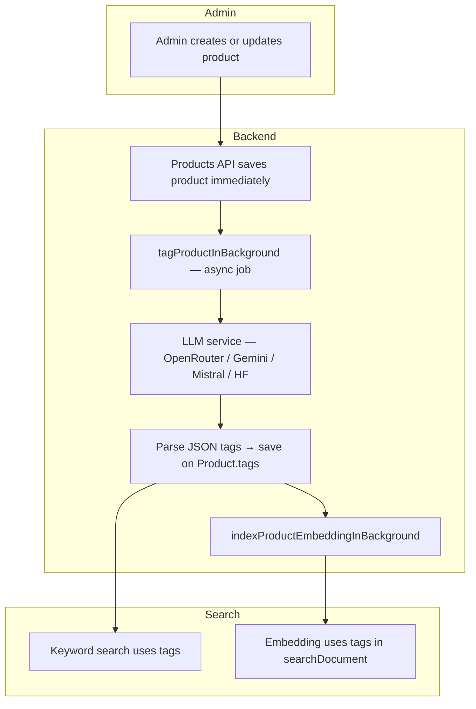
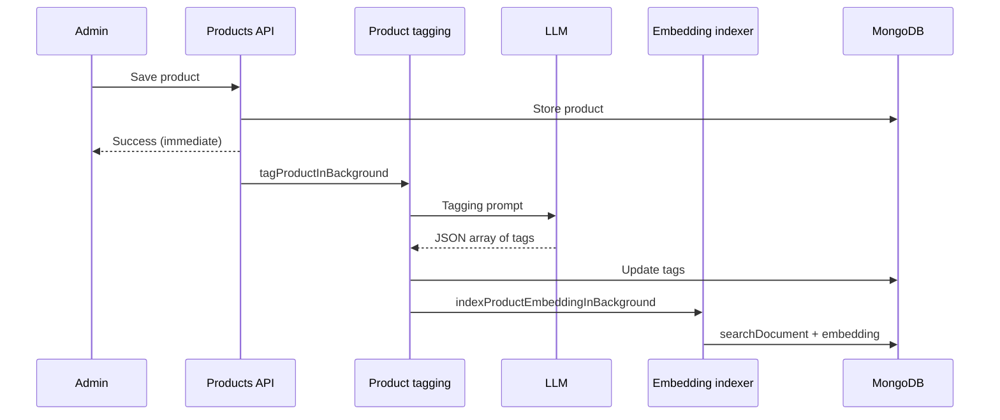

# ShopAI Product Tagging — How It Works

This document explains how ShopAI **automatically labels products with search tags** using AI after a product is created or updated. It is meant for **business and non-technical readers**, with a technical reference at the end.

---

## What is product tagging?

**Product tagging** means attaching a short list of **keywords** to each product—words a customer might type when searching.

Examples for a cricket bat:

- `cricket`, `bat`, `sports`, `mrf`, `willow`

These tags are **not** shown as the main product title. They are stored in the database field `tags` and used to:

1. **Improve keyword search** (the search box matches tags).  
2. **Improve semantic search** (tags are included in the text that gets embedded—see [Searchbox.md](./Searchbox.md)).

Tagging runs **in the background** so the admin does not wait on the “Save product” screen.

---

## Why do we use AI for tags?

Manually typing tags for hundreds of products is slow and inconsistent. An AI reads the **name, description, category, and brand** and suggests tags humans might forget—sport, occasion, material, style, or well-known associations (e.g. “ipl”, “virat kohli”).

The AI is instructed to return **only a JSON list of lowercase words**, which the server validates and saves.

---

## High-level architecture



---

## Step-by-step flow

### 1. Admin saves a product

- **Create:** `POST` admin product API → product is stored right away.  
- **Update:** `PUT` admin product API → changes are stored right away.

The HTTP response does **not** wait for tagging to finish.

### 2. Background tagging starts

Function: `tagProductInBackground(productId)` in `services/productTagging.js`.

1. Load the product from MongoDB.  
2. Build a **tagging prompt** with name, description, category, brand.  
3. Call **`chatCompletion`** from `services/llmService.js` (same AI stack as the chatbot—see [Chatbot.md](./Chatbot.md)).  
4. Parse the AI response into a string array (handles markdown fences and extra text).  
5. Normalize: lowercase, trim, max **12** tags.  
6. If at least one tag exists, update `product.tags` and save.

### 3. Search indexing follows

In a `finally` block (whether tagging succeeded or failed), the server schedules:

`indexProductEmbeddingInBackground(productId)` — waits ~500 ms, then builds `searchDocument` and **embedding** for hybrid search.

**On create only**, the products controller also triggers an **early** embed at ~2.5 seconds so search works even if tagging is slow. After tagging completes, embedding may run again with updated tags.

### 4. Customer-facing effect

- Search box and chatbot can find the product by tag words.  
- Vector search uses richer text because tags are part of `searchDocument`.



---

## What kind of tags does the AI produce?

The prompt asks for **3–8** lowercase tags covering:

| Category | Examples |
|----------|----------|
| Product type | bat, jersey, saree, shoes |
| Sport / activity | cricket, football, yoga, running |
| Occasion / use | wedding, casual, office, gym |
| Style | traditional, ethnic, western |
| Material | silk, leather, cotton |
| Associations | ipl, mrf, brand-related terms |

**Example AI output:**

```json
["cricket", "bat", "sports", "mrf", "virat kohli"]
```

If parsing fails or the AI returns nothing useful, **tags are left unchanged** (or empty on new products) and an error is logged— the product itself still exists.

---

## Services and providers used

| Piece | Service / file |
|-------|----------------|
| **Orchestration** | `services/productTagging.js` |
| **AI text generation** | `services/llmService.js` → `chatCompletion()` |
| **Trigger on save** | `controllers/productsCtrl.js` (`createProductCtrl`, `updateProductCtrl`) |
| **Search follow-up** | `services/search/vectorIndexService.js` |
| **Data model** | `model/Product.js` — field `tags: [String]` |

### LLM provider order (same as chatbot)

1. OpenRouter  
2. Google Gemini  
3. Mistral  
4. Hugging Face Inference Router  

No separate “tagging API key”—tagging uses the **chat LLM** environment variables:

- `OPENROUTER_API_KEY`, `OPENROUTER_MODEL`  
- `GEMINI_API_KEY`, `GEMINI_MODEL`  
- `MISTRAL_API_KEY`, `MISTRAL_MODEL`  
- `HUGGINGFACE_API_KEY`, `HUGGINGFACE_MODEL`  

---

## Relationship to other features

| Feature | How tagging helps |
|---------|-------------------|
| **Search box** | Tags matched in keyword search; included in embeddings |
| **Chatbot** | `search_products` tool uses the same search pipeline |
| **Admin UI** | Admin may still edit product fields; re-save triggers re-tag + re-embed |

---

## Operational notes

| Question | Answer |
|----------|--------|
| How long does tagging take? | Usually a few seconds; depends on AI provider speed. |
| What if AI is down? | Product remains saved; tags may be empty until next update or manual reindex path. |
| How to refresh all search vectors? | `npm run search:reindex` in Backend (see [Searchbox.md](./Searchbox.md)). |
| Does deleting a product remove tags? | The whole product document is removed from MongoDB. |

---

## Main code files

| File | Role |
|------|------|
| `services/productTagging.js` | Prompt, parse, save tags, trigger embed |
| `services/llmService.js` | Multi-provider LLM |
| `controllers/productsCtrl.js` | Calls tagging on create/update |
| `services/search/vectorIndexService.js` | Embedding after tags |
| `services/search/documentBuilder.js` | Includes tags in search text |
| `model/Product.js` | `tags` field |

---

## Related documentation

- [Searchbox.md](./Searchbox.md) — hybrid search, embeddings, rerankers  
- [Chatbot.md](./Chatbot.md) — assistant that searches the catalog  
- [CommentTagging.md](./CommentTagging.md) — review moderation and tags (different system)  
