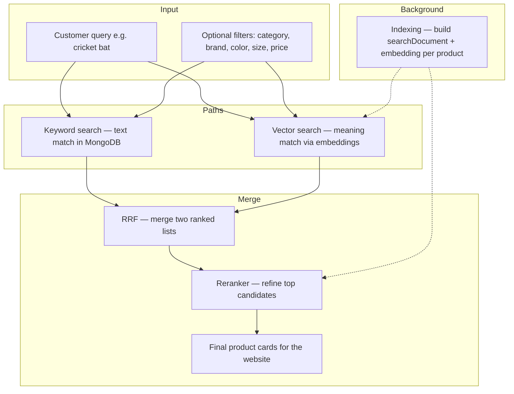
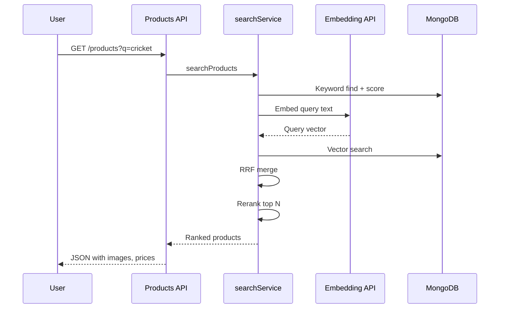

# ShopAI Search Box — How It Works

This document explains the **hybrid product search** behind the website search box (`/products-filters?q=...`) and the chatbot’s product search. It covers **embeddings**, **rerankers**, and how results are combined—written for **non-technical** readers first, with technical detail at the end.

---

## What is search in ShopAI?

When a customer types **“cricket bat”** in the search box, ShopAI tries to find products that:

1. **Contain those words** in the name, description, brand, category, or tags (classic keyword search).  
2. **Mean something similar** even if the exact words differ—for example “willow bat” or “sports bat” (semantic / vector search).  
3. Are **re-ordered** so the best matches appear first (reranking).

This combination is called **hybrid search**: several methods work together instead of relying on keywords alone.

---

## Key ideas (simple definitions)

| Term | Plain English |
|------|----------------|
| **Embedding** | A list of numbers that represents the *meaning* of text. Similar meanings → similar numbers. |
| **Vector search** | Finding products whose stored embedding is closest to the search query’s embedding. |
| **Keyword search** | Matching words in the database (like a traditional search box). |
| **Hybrid search** | Running keyword + vector search, then merging results. |
| **RRF** (Reciprocal Rank Fusion) | A fair way to merge two ranked lists without one method dominating. |
| **Reranker** | A second AI step that reads the query + each product snippet and picks the best order for the top results. |
| **searchDocument** | One paragraph of text per product (name, brand, tags, price, etc.) used for embeddings and reranking. |

---

## High-level architecture

---

## What happens when someone searches? (step by step)

### 1. Request enters the API

- **Website:** `GET /api/v1/products?q=cricket&category=...`  
- **Controller:** `controllers/productsCtrl.js` detects `q` and calls `searchProducts()` instead of a plain product list.

### 2. Keyword path (always runs when there is a query)

- File: `services/productSearch.js`  
- Builds a MongoDB filter: each word must appear somewhere (name, description, brand, category, or **tags**).  
- For multi-word queries (e.g. “cricket ball”), the **last word** must appear in the **product name** so unrelated items (e.g. a bat only tagged “cricket”) are reduced.  
- Scores and sorts matches, returns up to `SEARCH_KEYWORD_LIMIT` candidates (default 50).

### 3. Vector path (semantic)

- The **query text** is turned into an embedding via `services/search/embeddingService.js`.  
- `services/search/vectorSearch.js` finds similar products:
  - **MongoDB Atlas** (`mongodb+srv://`): uses Atlas **Vector Search** index (`ATLAS_VECTOR_INDEX`, default `product_vector_index`) on field `embedding`.  
  - **Otherwise (local/dev):** loads products with embeddings and compares using **cosine similarity** in application code.

### 4. Merge with RRF

- `services/search/hybridRanker.js` combines keyword and vector ID lists using **Reciprocal Rank Fusion** (`SEARCH_RRF_K`, default 60).  
- Products that rank well in **both** lists rise to the top.

### 5. Rerank (optional but recommended)

- For the top candidates, the **reranker** (`services/search/rerankService.js`) compares the customer’s query to each product’s `searchDocument`.  
- Can be turned off with `RERANK_ENABLED=false`.  
- If all rerank APIs fail, the RRF order is kept.

### 6. Response shape

- Each product is mapped with `mapProductSearchResult()` so the frontend gets `images`, `price`, `qtyLeft`, etc.  
- Search mode returns one page of results (pagination is simplified compared to browsing all products).

---

## How products get ready for search (indexing)

Search quality depends on **background indexing**:

| Step | What happens |
|------|----------------|
| **1. Product tagging** | AI adds searchable **tags** (see [ProductTagging.md](./ProductTagging.md)). |
| **2. Build search document** | `documentBuilder.js` joins name, brand, category, description, tags, colors, sizes, price, stock into one text block. |
| **3. Create embedding** | That text is sent to an embedding provider; numbers are saved on the product. |
| **4. Save on product** | Fields: `searchDocument`, `embedding`, `embeddingProvider`, `embeddingModel`, `embeddingVersion`, `embeddedAt`. |

**When indexing runs:**

| Trigger | Behavior |
|---------|----------|
| **New product** | Tagging runs in background; embedding runs after tags (and once early ~2.5s on create). |
| **Updated product** | Re-tag → re-embed in tagging’s `finally` block. |
| **Server startup** | `embeddingSyncService` fills missing or **stale** embeddings (`SEARCH_AUTO_SYNC_EMBEDDINGS`). |
| **Manual** | `npm run search:reindex` — re-embeds **all** products (use after model/version change). |

Bump `SEARCH_EMBEDDING_VERSION` when you change embedding model so old vectors are refreshed.

---

## Embedding providers

Configured by `EMBEDDING_PROVIDER` in `.env`. The service tries the preferred provider, then falls back through others that have API keys.

| Provider | Typical use |
|----------|-------------|
| **Hugging Face** (default) | `BAAI/bge-m3` via HF Inference Router |
| **Voyage** | `voyage-3-lite` |
| **Jina** | `jina-embeddings-v3` |
| **Google Gemini** | `text-embedding-004` |
| **OpenRouter** | e.g. `openai/text-embedding-3-small` |

**API keys:** `HUGGINGFACE_API_KEY`, `VOYAGE_API_KEY`, `JINA_API_KEY`, `GEMINI_API_KEY`, `OPENROUTER_API_KEY`.

---

## Reranker providers

Configured by `RERANK_PROVIDER`. Fallback order in code: preferred → Voyage → Jina → Cohere → OpenRouter.

| Provider | Example model (env) |
|----------|---------------------|
| **Voyage** (default) | `RERANK_MODEL=rerank-2.5` |
| **Jina** | `JINA_RERANK_MODEL` |
| **Cohere** | `COHERE_RERANK_MODEL` |
| **OpenRouter** | `OPENROUTER_RERANK_MODEL` |

**API keys:** `VOYAGE_API_KEY`, `JINA_API_KEY`, `COHERE_API_KEY`, `OPENROUTER_API_KEY`.

Set `RERANK_ENABLED=false` to skip reranking (faster, less accurate ordering).

---

## Filters with search

The same query string can be combined with filters from the products page:

| Query param | Effect |
|-------------|--------|
| `category` | Limit to category |
| `brand` | Limit to brand |
| `color` | Limit to color |
| `size` | Limit to size |
| `price` | Range like `1000-2000` (INR) |
| `inStock=true` | Only in-stock items |

Filters apply to **both** keyword and vector legs before merge.

---

## Chatbot vs website search

Both use `searchProducts()` in `services/search/searchService.js`.

| | Website search box | Chatbot `search_products` tool |
|--|-------------------|--------------------------------|
| Entry | `GET /products?q=` | Tool executor in `chatTools.js` |
| Wrapper | Direct API response | `searchProductsForChat()` adds strict listing rules for the AI |
| Pipeline | Same hybrid + rerank | Same |

---

## Configuration summary

| Variable | Default | Meaning |
|----------|---------|---------|
| `EMBEDDING_PROVIDER` | `huggingface` | Primary embedding service |
| `EMBEDDING_MODEL` | `BAAI/bge-m3` | HF model name |
| `RERANK_PROVIDER` | `voyage` | Primary reranker |
| `RERANK_ENABLED` | `true` | Turn reranking on/off |
| `RERANK_TOP_N` | `30` | How many candidates to rerank |
| `ATLAS_VECTOR_INDEX` | `product_vector_index` | Atlas index name |
| `SEARCH_RRF_K` | `60` | RRF constant |
| `SEARCH_KEYWORD_LIMIT` | `50` | Max keyword candidates |
| `SEARCH_VECTOR_LIMIT` | `50` | Max vector candidates |
| `SEARCH_EMBEDDING_VERSION` | `1` | Bump to re-index stale products |
| `SEARCH_AUTO_SYNC_EMBEDDINGS` | `true` | Startup catch-up indexing |

Full list: `Backend/.env.example` and `config/env.js`.

---

## Main code files

| File | Role |
|------|------|
| `controllers/productsCtrl.js` | Routes `q` to hybrid search |
| `services/search/searchService.js` | Orchestrates hybrid pipeline |
| `services/productSearch.js` | Keyword filter + scoring |
| `services/search/vectorSearch.js` | Atlas or local vector search |
| `services/search/embeddingService.js` | Create embeddings |
| `services/search/rerankService.js` | Rerank top results |
| `services/search/hybridRanker.js` | RRF merge |
| `services/search/documentBuilder.js` | Build `searchDocument` text |
| `services/search/vectorIndexService.js` | Save embedding on product |
| `services/search/embeddingSyncService.js` | Startup sync |
| `scripts/reindex-embeddings.js` | Manual full reindex |
| `model/Product.js` | `embedding`, `searchDocument`, etc. |

---

## Related documentation

- [ProductTagging.md](./ProductTagging.md) — AI tags that improve keyword search and embeddings  
- [Chatbot.md](./Chatbot.md) — how chat uses search  
- [CommentTagging.md](./CommentTagging.md) — review moderation (separate from product search)  
