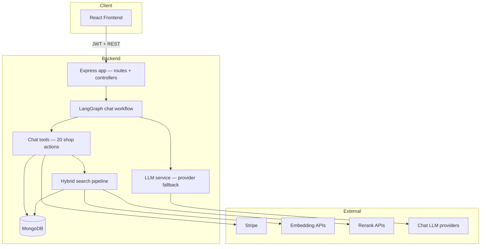
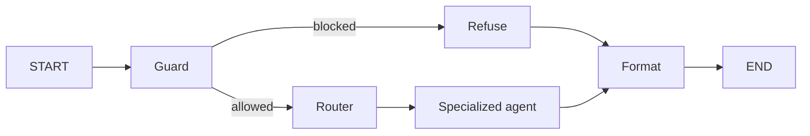
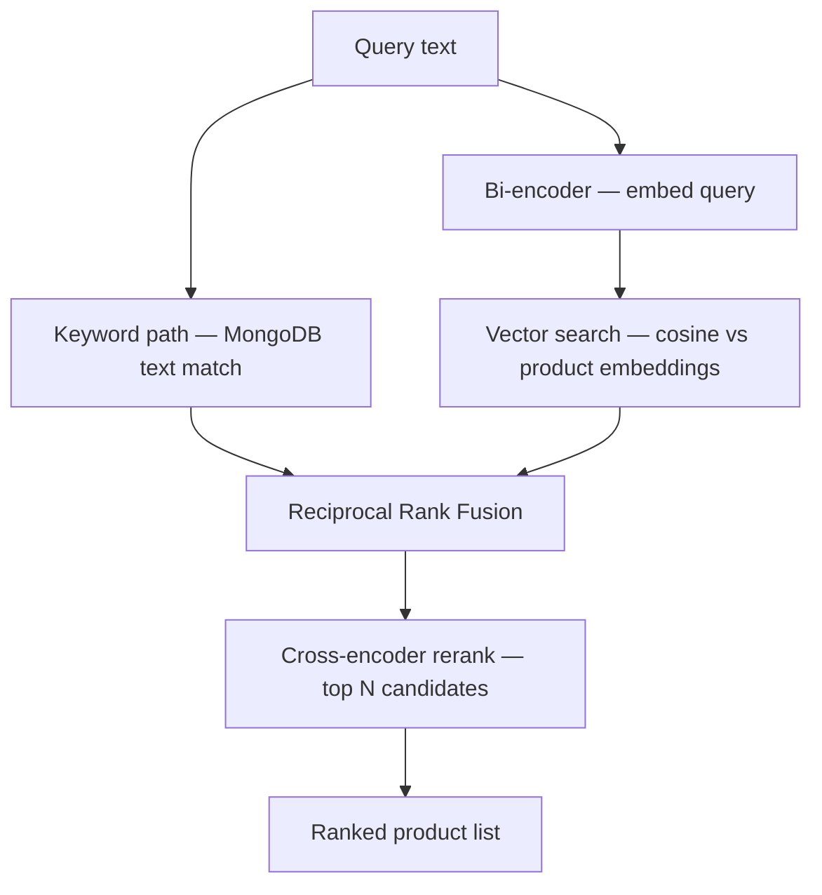

# ShopAI — Developer Guide

Technical overview of the ShopAI monorepo: architecture, request flows, the chatbot pipeline, hybrid retrieval, and admin tooling.

---

## Repository layout

| Path | Role |
|------|------|
| `Frontend/` | React storefront, Shop with AI UI, admin dashboard, Developer Analytics |
| `Backend/` | Express API, MongoDB models, AI services, search pipeline, Stripe webhooks |
| `Backend/.env.example` | Environment variable reference — copy to `Backend/.env` |
| `Backend/docs/` | Focused deep-dives (chatbot, search box, product/review tagging) |

**Stack:** Node.js 20+, Express, MongoDB (Mongoose), React, Stripe, multi-provider LLM APIs.

---

## System architecture



**Layers:**

1. **Frontend** — product browsing, cart, checkout UI, full-page chat, admin CRUD, Developer Analytics.
2. **API** — auth middleware, validation (Zod), rate limits, controllers.
3. **Services** — business logic isolated from HTTP (cart, checkout, search, chat graph, LLM).
4. **Data** — MongoDB for users, products, orders, carts, chat sessions, embeddings on products.

There is **no WebSocket chat streaming** today. Each chat message is a single HTTP request/response cycle.

---

## What happens at runtime

### Typical product search (website)

1. User opens `/products-filters?q=cricket+bat`.
2. `GET /api/v1/products?q=...` hits `productsCtrl.js`.
3. When `q` is present, `searchProducts()` runs the hybrid pipeline (see [Retrieval](#retrieval-hybrid-search-bi-encoder--cross-encoder-rerank)).
4. JSON product cards return to the React product list.

### Typical chat message

1. Logged-in user sends `POST /shopai/chat/message` with `message` and optional `sessionId`.
2. `chatCtrl.js` trims history to a **token budget**, loads session, calls `runChatGraph()` inside an LLM usage context.
3. LangGraph runs **guard → router → specialized agent → format**.
4. Agent may loop on tools (up to 7 rounds) — search, cart, orders, checkout, etc. Tool results are **compacted** before they enter the LLM message history.
5. **Deterministic assist** (`chatDeterministicAssist.js`) — rule-based fallbacks when the agent skips tools (cart variants, pasted addresses, checkout picker). Disable with `ENABLE_CHAT_DETERMINISTIC_ASSIST=false`.
6. Reply sanitization, checkout-backed reply, client actions; route + `routeReason` logged for observability.
7. Response JSON: `reply`, optional `clientActions`, `cartSummary`, `checkout`, `sessionId`.

### Background jobs (not user-facing)

| Job | When | What |
|-----|------|------|
| Product AI tagging | Product create/update | Adds searchable tags (`ProductTagging`) |
| Embedding sync | Startup queue or in-process fallback | Builds `searchDocument` + bi-encoder vectors (`embeddingSyncQueue.js`) |
| Checkout expiry | After Stripe session created | BullMQ job expires unpaid checkout if the tab closes (`checkoutQueue.js`) |
| Coupon cache bust | Coupon create/update + at `endDate` | Invalidates `coupons:active` precisely at boundaries |
| Stripe webhooks | Payment events | `orderService.applyStripeCheckoutSession()` → fulfillment |
| Chat eval suite | Admin triggers from Developer Analytics | Background job with polling status |
| LLM usage flush | Every 5s or 100 records | Batched `LlmUsageLog` inserts (`llmUsageLogger.js`) |

---

## Chatbot architecture (LangGraph)

The assistant no longer uses a single monolithic prompt + full tool list. Each message flows through a compiled **LangGraph** workflow in `Backend/services/chatGraph/`.



### Nodes

| Node | Purpose |
|------|---------|
| **Guard** | LLM safety classifier (`guardClassifier.js`) for prompt injection and off-topic requests; fails open if LLM unavailable |
| **Router** | Keyword intent routing to one of eight agents |
| **Agent** | Scoped system prompt + subset of tools + internal tool loop |
| **Refuse** | Fixed safe reply when guard blocks |
| **Format** | Catalog-backed product listings + strip fake Stripe URLs / bad markup |

### Specialized agents

| Route | Typical intents | Tools (subset) |
|-------|-----------------|----------------|
| `retrieval` | “Show me cricket bats”, browse, recommend | `search_products`, `get_product_details`, categories, brands |
| `comparison` | “Which bat is better?” | Same as retrieval |
| `payment` | “Did my payment go through?” | `get_my_orders`, `get_order_details` |
| `order_summary` | “My recent orders” | `get_my_orders`, `get_order_details` |
| `order_update` | Cancel, return, refund | Order tools + `cancel_order`, `submit_return_request` |
| `checkout` | Cart, coupons, addresses, pay | Cart, address, preview/create checkout tools |
| `policies` | Return policy, how checkout works | Policy prompt + `get_active_coupons` |
| `general` | Greeting, identity, broad help | Light tool set |

### Tool execution

- All **20 tools** live in `Backend/services/chatTools.js`.
- Each agent only receives the tools it needs — smaller context, fewer wrong tool calls.
- Tool results are real DB/API data; the formatter enforces **strict product listings** from `search_products` output.

### Chat pipeline: one LLM path, two phases

| Phase | Module | Role |
|-------|--------|------|
| **1. LangGraph** | `services/chatGraph/` | Guard, intent router, specialized agent + tools |
| **2. Deterministic assist** | `services/chatDeterministicAssist.js` | Cart/checkout/address fallbacks when tools were skipped — **not** a second LLM |

Further detail: [`Backend/docs/Chatbot.md`](../Backend/docs/Chatbot.md) (two-phase section).

### Token & context optimizations

| Technique | Where | Purpose |
|-----------|--------|---------|
| Tool result compaction | `chatGraph/toolResultCompact.js` | Strip images, embeddings, long descriptions from tool messages before LLM history |
| System prompt cache | `getAgentSystemPrompt()` + module-scoped `promptCache` | Same `(route, userName)` prompt built once per process |
| Token-budget history | `utils/chatHistoryTrim.js` | Drop oldest turns when history exceeds `CHAT_HISTORY_TOKEN_BUDGET` (default 8000 est. tokens) |
| Batched usage logs | `llmUsageLogger.js` | `insertMany` buffer instead of per-call writes |

### Route observability

Each chat request logs routing to `LlmUsageLog`:

- `patchLlmUsageContext({ route, routeReason })` after the graph runs
- `recordChatRouteDecision()` — one `span: 'route-decision'` row per message for classifier/heuristic evaluation
- Agent LLM spans inherit `route` + `routeReason` from context set in `routerNode`

Query production: filter `span: 'route-decision'` or group `byRoute` in Developer Analytics.

### LLM provider fallback

`llmService.js` tries providers in order until one succeeds:

1. OpenRouter  
2. Google Gemini (`geminiClient.js` — native API with OpenAI-compatible fallback)  
3. Mistral  
4. Hugging Face Inference Router  
5. Groq  

Chat eval and live chat both call `runChatGraph()` so behavior stays aligned.

### Key files

| File | Role |
|------|------|
| `services/chatGraph/index.js` | `runChatGraph()` entry point |
| `services/chatGraph/graph.js` | StateGraph compile |
| `services/chatGraph/guardClassifier.js` | LLM safety gate (injection / off-topic) |
| `services/chatGraph/guard.js` | Guard node + refuse messages |
| `services/chatGraph/router.js` | Intent → route |
| `services/chatGraph/agentRunner.js` | Per-agent LLM + tool loop |
| `services/chatGraph/agentPrompts.js` | Scoped system prompts |
| `services/chatPostProcess.js` | Sanitize, catalog reply, checkout reply helpers |
| `controllers/chatCtrl.js` | HTTP layer, sessions, usage context |
| `services/chatDeterministicAssist.js` | Post-graph cart/checkout/address fallbacks |
| `services/chatSessionService.js` | Persist conversations |
| `utils/chatHistoryTrim.js` | Token-budget history trimming |

Further detail: [`Backend/docs/Chatbot.md`](../Backend/docs/Chatbot.md)

---

## Retrieval: hybrid search, bi-encoder & cross-encoder rerank

Product discovery (website search box **and** chat `search_products` tool) uses the same pipeline in `Backend/services/search/searchService.js`.

### Mental model

| Stage | Model type | Role |
|-------|------------|------|
| **Keyword search** | Classic text match | Fast recall on exact words in name, description, brand, category, tags |
| **Vector search** | **Bi-encoder** (embedding model) | Encode query and each product *independently*; rank by cosine similarity |
| **RRF merge** | Rank fusion | Combine keyword + vector lists without one dominating |
| **Rerank** | **Cross-encoder** (reranker model) | Score query + each candidate *together* for precise final ordering |

**Bi-encoder** (e.g. `BAAI/bge-m3` via Hugging Face): cheap at scale — one embedding per product at index time, one embedding per query at search time. Good recall, weaker fine-grained ordering.

**Cross-encoder reranker** (e.g. Voyage `rerank-2.5`, Cohere, Jina): expensive per pair but much better at “does this product actually match this query?” Used only on the top ~30 RRF candidates.



### Indexing pipeline

1. **AI product tags** — improves keyword leg and `searchDocument` text ([ProductTagging.md](../Backend/docs/ProductTagging.md)).
2. **`documentBuilder.js`** — concatenates name, brand, category, description, tags, variants, price, stock into `searchDocument`.
3. **`embeddingService.js`** — bi-encoder API → vector stored on `Product.embedding`.
4. **`embeddingSyncService.js`** — startup catch-up for missing/stale embeddings; bump `SEARCH_EMBEDDING_VERSION` to force refresh.
5. **Manual reindex** — `npm run search:reindex` in `Backend/`.

### Search request pipeline

1. **Keyword path** — `productSearch.js`: multi-word rules, scoring, limit `SEARCH_KEYWORD_LIMIT`.
2. **Vector path** — embed query → `vectorSearch.js` (Atlas Vector Search on `mongodb+srv://`, else in-app cosine similarity locally).
3. **RRF** — `hybridRanker.js`, constant `SEARCH_RRF_K`.
4. **Rerank** — `rerankService.js` on top `RERANK_TOP_N` documents; skipped if `RERANK_ENABLED=false` or all APIs fail.
5. **Map** — `mapProductSearchResult()` for API/chat consumption.

Chat wraps this via `searchProductsForChat()` in `chatTools.js` with strict listing metadata so the formatter can override hallucinated product lists.

Further detail: [`Backend/docs/Searchbox.md`](../Backend/docs/Searchbox.md)

---

## Redis, BullMQ & response cache

Optional **`REDIS_URL`** powers job queues and a shared response cache. Without Redis, the API falls back to MongoDB for reads and client poll + webhooks for checkout.

### BullMQ queues

| Queue | Flag | Purpose |
|-------|------|---------|
| Checkout expiry | `ENABLE_CHECKOUT_QUEUE=true` | Expire unpaid Stripe sessions when `checkoutExpiresAt` passes |
| Embedding sync | `ENABLE_EMBEDDING_SYNC_QUEUE=true` | Deferred embedding backfill on startup |
| Coupon cache bust | (auto when Redis set) | `DEL` coupon keys at `startDate` / `endDate` |

**Worker placement**

| Environment | `RUN_QUEUE_WORKERS_IN_API` | What to run |
|-------------|---------------------------|-------------|
| Local dev / test | `true` (default) | `npm run dev` — workers inside API |
| Production | `false` (default when `NODE_ENV=production`) | API: `npm run start:server` **and** worker: `npm run start:worker` |

Do not run checkout expiry, embedding sync, and coupon-cache workers in the same Node process as production HTTP traffic unless you explicitly set `RUN_QUEUE_WORKERS_IN_API=true` (not recommended — slow jobs compete with request handling).

```bash
# Production worker process (separate from API)
cd Backend && npm run start:worker
```

Graceful shutdown: workers → LLM usage flush → Redis cache quit → HTTP server.

### Response cache (`cacheService.js`)

Invalidate-on-mutation plus safety TTL. All callers use `cacheService` — never raw Redis.

| Key pattern | TTL | Invalidated on |
|-------------|-----|----------------|
| `catalog:categories:all` | 60s | Category CRUD + product CRUD |
| `catalog:brands:all` | 60s | Brand CRUD |
| `catalog:colors:all` | 60s | Color CRUD |
| `coupons:active`, `coupons:code:*` | 120s | Coupon CRUD + BullMQ at `endDate` |
| `products:list:*` | 300s | Product CRUD only (not orders) |

**Not cached:** search/chat results, store policy, per-product stock-sensitive reads.

---

## Orders & fulfillment

Canonical order logic lives in **`services/orderService.js`** (`orderService` singleton). Controllers, chat tools, webhooks, and payment polling all call it — no duplicated Stripe update + fulfillment blocks.

| Concern | Module |
|---------|--------|
| CRUD, cancel, stats, chat summaries | `orderService.js` |
| Paid-order stock + confirmation email | `orderFulfillment.js` |
| Stripe refunds / payment refs | `orderRefund.js` |
| Checkout session creation | `orderCheckout.js` |
| Payment poll + manual expire | `orderPaymentPollService.js` |
| Chat cancel/return orchestration | `orderActionsService.js` |

**Payment sync path:** `orderService.applyStripeCheckoutSession()` — used by webhook, verify-payment, and poll.

**Stock:** atomic reservation on pay (`stockService.js`); `releaseStock` on cancel.

---

## Developer Analytics

Admin-only UI at `/admin/developer-analytics` (requires admin role).

| Tab | API | Purpose |
|-----|-----|---------|
| **Inference** | `GET/POST /shopai/analytics/inference/*` | Smoke-test LLM providers with model picker and a “Hi” prompt |
| **Evaluate Chatbot** | `POST /shopai/analytics/chat-eval/run`, `GET .../status/:jobId` | Run golden test cases with live progress, deterministic checks, and LLM judge |

Eval cases live in `Backend/services/chatEvalCases.js`. Each case runs through **`runChatGraph()`** — same pipeline as production chat. Cases are spaced by ~10s to reduce Gemini rate-limit errors during full suite runs.

---

## Environment & local setup

1. Copy `Backend/.env.example` → `Backend/.env` and fill keys.
2. MongoDB running locally or Atlas URI in `MONGO_URL`.
3. `cd Backend && npm install && npm run dev`
4. `cd Frontend && npm install && npm start`

**Minimum for chat:** `JWT_KEY`, `MONGO_URL`, at least one LLM key (`OPENROUTER_API_KEY` recommended).

**Minimum for semantic search:** embedding key (`HUGGINGFACE_API_KEY` default) + products indexed.

**Minimum for rerank:** `VOYAGE_API_KEY` (default provider) or another rerank provider key.

**Stripe:** `STRIPE_KEY` + webhook secret for checkout; use `npm start` in Backend to run server + `stripe listen`.

**Redis (optional):** `REDIS_URL` enables cache + queues. See `Backend/.env.example` for `ENABLE_CHECKOUT_QUEUE`, `ENABLE_EMBEDDING_SYNC_QUEUE`, `RUN_QUEUE_WORKERS_IN_API`, `ENABLE_CHAT_DETERMINISTIC_ASSIST`.

Run tests: `cd Backend && npm test`

---

## Related documentation

| Document | Topic |
|----------|-------|
| [`Backend/docs/Chatbot.md`](../Backend/docs/Chatbot.md) | Chat API, tools, sessions, response shape |
| [`Backend/docs/Searchbox.md`](../Backend/docs/Searchbox.md) | Hybrid search, embeddings, rerankers, config |
| [`Backend/docs/ProductTagging.md`](../Backend/docs/ProductTagging.md) | AI tags for catalog search |
| [`Backend/docs/CommentTagging.md`](../Backend/docs/CommentTagging.md) | Review moderation and tags |
| [`Backend/.env.example`](../Backend/.env.example) | Full environment reference |

---

## Quick reference — main entry points

| Concern | Entry |
|---------|--------|
| Chat message | `POST /shopai/chat/message` → `chatCtrl.js` → `runChatGraph()` → `runDeterministicChatAssist()` |
| Product search | `GET /api/v1/products?q=` → `searchProducts()` |
| Product browse (cached) | `GET /api/v1/products` (no `q`) → `productsCtrl` + Redis cache |
| Chat product search | Tool `search_products` → `searchProductsForChat()` |
| Orders | `services/orderService.js` |
| LLM calls + usage logs | `services/llmService.js`, `services/llmUsageLogger.js` |
| Graph compile | `services/chatGraph/graph.js` |
| Cache | `services/cacheService.js`, `services/catalogCache.js` |
| Queues | `services/queueWorkers.js`, `worker.js` |
| Embeddings | `services/search/embeddingService.js` |
| Reranking | `services/search/rerankService.js` |
