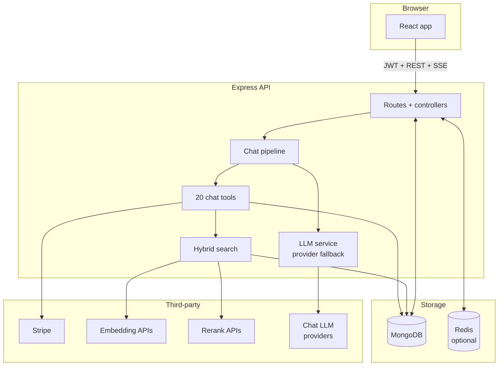
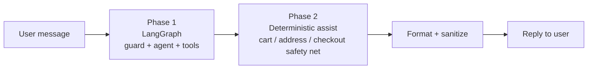
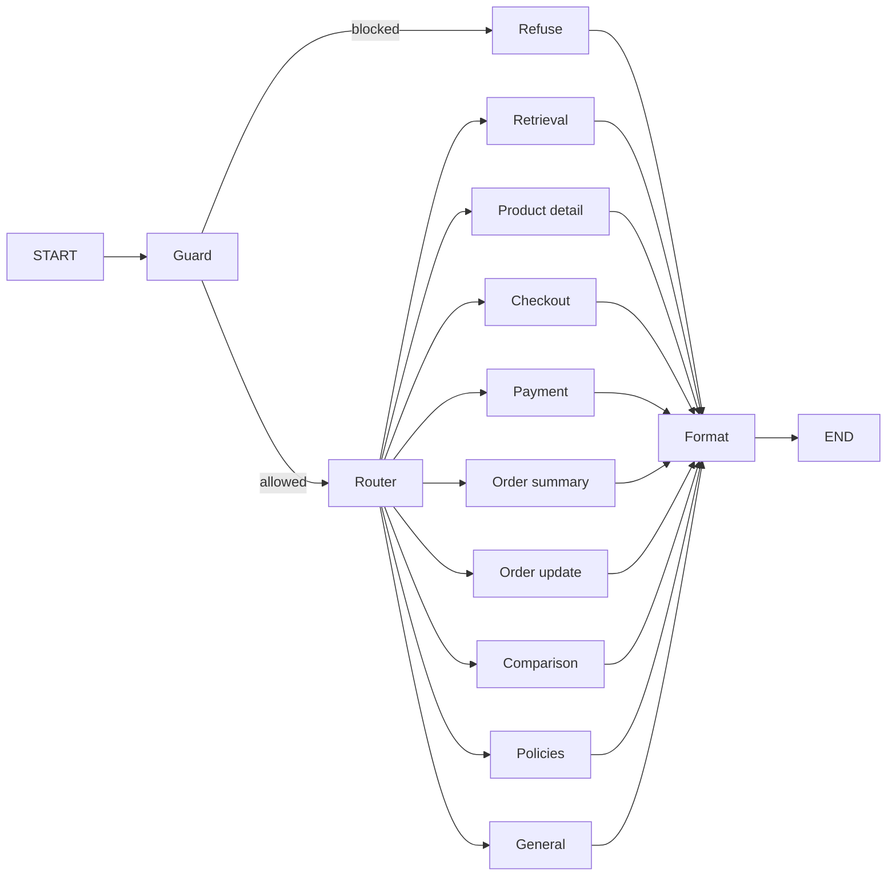
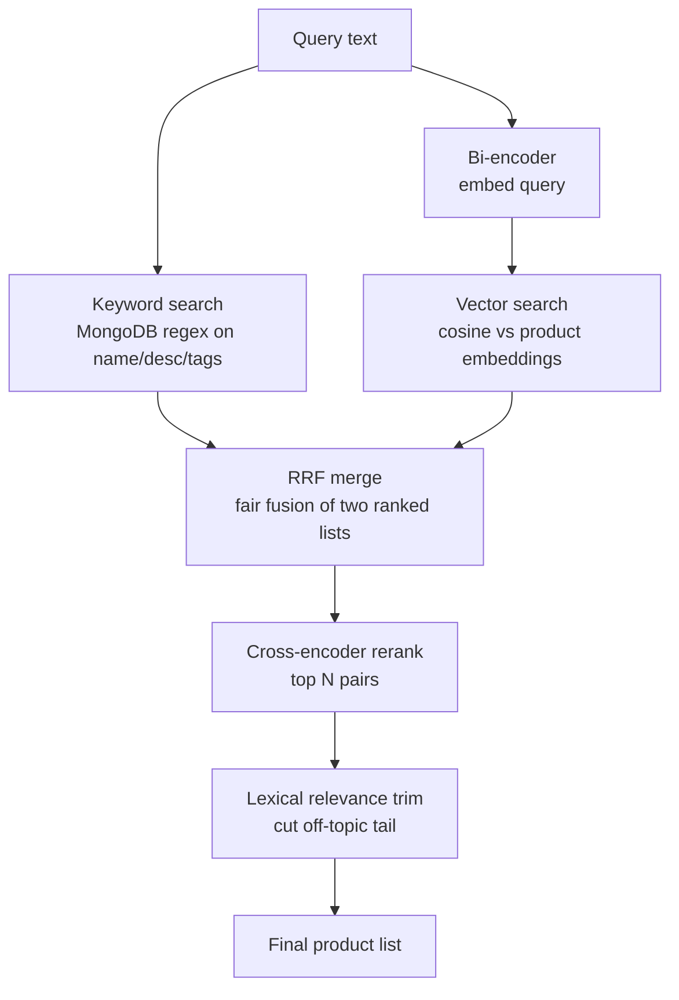
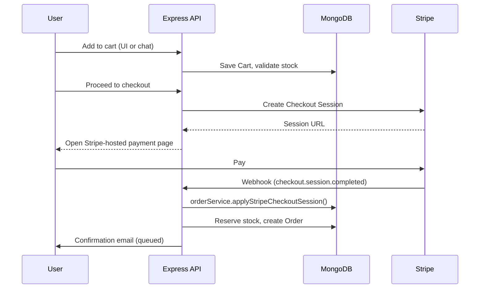

# ShopAI — Developer Guide

A plain-language tour of the codebase: what each piece does, how a request flows end-to-end, and where to look when you change something.

> **One-line summary:** ShopAI is an e-commerce site (React + Express + MongoDB) with a multilingual shopping chatbot on top. The chatbot understands your message in one LLM call (a "planner"), then either talks to product/cart/order tools or replies directly.

---

## 1. What's in the repo

| Path | What lives here |
|------|-----------------|
| `Frontend/` | React app — storefront, cart, checkout, chat UI, admin dashboard |
| `Backend/` | Express API, MongoDB models, chat pipeline, search pipeline, Stripe |
| `Backend/.env.example` | All environment variables documented — copy to `Backend/.env` |
| `Backend/docs/` | Deep-dives (chatbot, search, tagging) |
| `docs/README.md` | **You are here** — high-level guide |

**Stack:** Node 20+, Express, MongoDB (Mongoose), React, Stripe, multi-provider LLM APIs, optional Redis + BullMQ.

---

## 2. The big picture



Four layers:

1. **Frontend** — browses products, manages cart/checkout, hosts the chat widget + full-page chat, admin CRUD.
2. **API** — auth (JWT cookies), Zod validation, rate limits, controllers.
3. **Services** — pure business logic (cart, checkout, orders, search, chat). No HTTP code here.
4. **Data** — MongoDB for everything persistent; Redis (optional) for cache + job queues.

---

## 3. What happens when a user…

### …searches products on the storefront

```
URL /products-filters?q=cricket+bat
    → GET /api/v1/products?q=cricket+bat
    → productsCtrl.js
    → searchProducts()       (keyword + vector + RRF + rerank + relevance trim)
    → JSON product cards
```

### …sends a chat message

```
POST /shopai/chat/message  (or stream variant)
    → chatCtrl.js
       1. load session + trim history to token budget
       2. runChatGraph()             ← LangGraph: guard → router → agent
       3. runDeterministicChatAssist() ← rule-based safety net
       4. format reply + persist
    → JSON { reply, clientActions?, cartSummary?, checkout?, sessionId }
```

### …completes checkout

```
Chat or cart UI
    → checkoutFromCart()     (creates Stripe session, server-side cart snapshot)
    → user pays on Stripe
    → Stripe webhook → orderService.applyStripeCheckoutSession()
    → order created, stock reserved, confirmation email queued
```

---

## 4. The chatbot pipeline (the heart of ShopAI)

The chatbot is **two phases**, not two competing LLM systems:



- **Phase 1 (LangGraph)** decides intent, picks an agent, and the agent calls tools.
- **Phase 2 (deterministic assist)** runs only when the agent skipped a tool call it should have made (e.g. didn't fetch the cart). It cannot overwrite a "locked" reply from Phase 1.

### 4a. Phase 1 — LangGraph in detail



**Guard node** decides three things in **one LLM call** (the *planner*):

| Decision | Example output |
|----------|----------------|
| Is it safe? | `allowed: true` or `block_reason: injection / off_topic` |
| What language? | `language: te, label: Telugu, script: latin` (Telugu in English letters) |
| What does the user want? | `action: view_details, product_ref: { kind: ordinal, value: 2 }` |

This single planner call replaces the older "safety classifier → fused router → purchase intent extractor" chain. For obviously-English shopping queries (e.g. "show me cricket bats") a heuristic short-circuits the LLM entirely.

**Router node** uses the planner's `route` field to send the message to one of nine specialized agents:

| Route | Typical user intent | Tools available (subset) |
|-------|---------------------|--------------------------|
| `retrieval` | "Show me cricket bats" | `search_products`, categories, brands |
| `product_detail` | "Tell me about the first one" | `get_product_details` |
| `comparison` | "Which bat is better?" | Retrieval tools |
| `checkout` | "Add 2 to cart", "checkout" | Cart, address, checkout tools |
| `payment` | "Did my payment go through?" | Order + payment tools |
| `order_summary` | "My recent orders" | Order tools |
| `order_update` | "Cancel order #123" | `cancel_order`, `submit_return_request` |
| `policies` | "Return policy?" | Policy text + `get_active_coupons` |
| `general` | Greetings, identity | Light tool set |

**Agent node** has a small system prompt + only the tools its route needs (smaller context = fewer wrong tool calls). It can loop on tools up to 7 rounds.

**Format node** sanitizes the reply: catalog-backed product listings, no fake Stripe URLs, no hallucinated markdown.

### 4b. Phase 2 — Deterministic assist

Five small modules run in sequence after the graph. Each only acts if the agent missed something **and** the reply isn't locked:

```
runDeterministicChatAssist
  ├─ retrievalAssist        (re-run search if agent forgot)
  ├─ productDetailAssist    (resolve ordinal picks → product details) — locks reply
  ├─ cartAssist             (handle "add it" follow-ups, multi-add queue)
  ├─ addressAssist          (parse pasted address into shipping fields)
  └─ checkoutAssist         (start Stripe session if user said "proceed")
```

The **reply-lock** mechanism prevents earlier good replies (e.g. a product detail card) from being overwritten by later assists that misinterpret an ordinal pick as an address selection — a bug class the project hit repeatedly before.

### 4c. Multilingual support

The planner detects:

- **English** → reply in English.
- **Native script** (Hindi/Telugu/Tamil/...) → reply in that script.
- **Transliterated** (e.g. "naaku oka cricket ball kavali" = Telugu in English letters) → reply in the **same transliterated style**, friendly and natural.

The agent's system prompt receives a `LANGUAGE_HINT` block from the planner; product names, prices (₹), markdown links, and tool arguments always stay in English regardless of reply language.

### 4d. Message kinds — context with intent

Every assistant message is tagged with a `messageKind` when persisted:

`product_listing`, `product_detail`, `cart_summary`, `cart_confirm`, `address_picker`, `address_saved`, `checkout_link`, `order_summary`, `order_update`, `policy`, `greeting`, `refuse`, `reply`.

Why it matters: when the user says "the second one", we know from the *previous* assistant's `messageKind` whether it's an ordinal product pick (`product_listing`) or an address pick (`address_picker`). No more brittle regex on rendered markdown.

### 4e. Sessions, history, streaming

- Sessions stored in `ChatSession` (Mongoose), up to 100 messages per session, 50 sessions per user.
- History sent to the LLM is trimmed to a token budget (`CHAT_HISTORY_TOKEN_BUDGET`, default ~8k est. tokens).
- Catalog products from listings are stored as structured `catalogProducts[]` on the assistant message — no need to re-parse markdown to resolve "first/second/etc".
- **Streaming endpoint** `POST /shopai/chat/message/stream` (SSE) emits `route`, `tool_start`, `tool_end`, `text_delta`, and a final `done` event.

### 4f. Key files

| File | Role |
|------|------|
| `services/chatPlanner.js` | **Single LLM planner** — language + intent + slots + product ref |
| `services/chatGraph/graph.js` | LangGraph compile |
| `services/chatGraph/guard.js` | Safety + heuristic shortcut + planner |
| `services/chatGraph/agentPrompts.js` | Route system prompts + multilingual hint injection |
| `services/chatGraph/agentRunner.js` | Per-agent LLM + tool loop |
| `services/chatGraph/productContext.js` | Product reference resolution (ordinals, pending, etc.) |
| `services/chatTools.js` | All 20 chat tools |
| `services/chatDeterministicAssist.js` | Phase-2 orchestrator |
| `services/chatPostProcess.js` | Reply formatting + sanitization |
| `services/chatSessionService.js` | Persist + load sessions |
| `controllers/chatCtrl.js` | HTTP layer for chat (sync + SSE) |

Deep-dive: [`Backend/docs/Chatbot.md`](../Backend/docs/Chatbot.md)

---

## 5. Search & retrieval (used by storefront *and* chat)



| Stage | What it does | Why it's there |
|-------|--------------|----------------|
| Keyword | Exact word match on name/desc/brand/tags | Cheap, high precision when the user uses the right words |
| Bi-encoder | One embedding per query, cosine vs product embeddings | Catches synonyms and intent |
| RRF | Reciprocal Rank Fusion of the two lists | Neither list dominates |
| Cross-encoder | Re-scores each (query, product) pair together | Best fine-grained ordering |
| **Trim** | Drops items whose lexical score is < 55% of top, or after a > 50% score gap | **Stops "3 relevant + 9 noise" tails** |

The trim step is what fixed the "after 3 good products, irrelevant ones appear" bug — the reranker keeps semantically-similar but off-topic items (e.g. cricket helmet for a cricket bat query); the lexical pass drops them.

### Indexing

1. **AI product tags** improve recall (`ProductTagging.md`).
2. `documentBuilder.js` builds `searchDocument` (name + brand + category + tags + description).
3. `embeddingService.js` produces vectors → stored on `Product.embedding`.
4. `embeddingSyncService.js` catches up missing/stale embeddings at startup.
5. Manual refresh: `cd Backend && npm run search:reindex`.

Deep-dive: [`Backend/docs/Searchbox.md`](../Backend/docs/Searchbox.md)

---

## 6. Cart, checkout, orders



Canonical order logic is `services/orderService.js` — controllers, chat tools, webhooks, and payment polling all call the same module.

| Concern | Module |
|---------|--------|
| Cart CRUD + qtyLeft + price warnings | `services/cartService.js` |
| Checkout session creation | `services/orderCheckout.js` |
| Payment sync (webhook + verify + poll) | `services/orderService.applyStripeCheckoutSession()` |
| Stock reservation / release | `services/stockService.js` |
| Cancel + return orchestration (from chat) | `services/orderActionsService.js` |
| Order CRUD + stats | `services/orderService.js` |
| Refunds | `services/orderRefund.js` |

---

## 7. Background jobs (BullMQ, optional)

| Job | Trigger | Purpose |
|-----|---------|---------|
| Product AI tagging | Product create/update | Add searchable tags |
| Embedding sync | Startup | Backfill missing/stale vectors |
| Checkout expiry | After Stripe session created | Expire unpaid sessions |
| Coupon cache bust | At `startDate` / `endDate` | Invalidate `coupons:active` precisely |
| Stripe webhooks | Payment events | Trigger fulfillment |
| Chat eval suite | Admin trigger | Run golden test cases |
| LLM usage flush | Every 5s or 100 records | Batched `LlmUsageLog` inserts |

### Worker placement

| Environment | `RUN_QUEUE_WORKERS_IN_API` | What to run |
|-------------|---------------------------|-------------|
| Dev / test | `true` (default) | `npm run dev` — workers inside API |
| Production | `false` (default in `NODE_ENV=production`) | API: `npm run start:server` **and** worker: `npm run start:worker` |

Don't run heavy jobs alongside production HTTP traffic — they compete for CPU and event loop.

---

## 8. Caching (Redis, optional)

Without Redis everything still works — slower for hot reads, no job queues, no checkout-expiry timer (relies on Stripe webhooks).

| Key pattern | TTL | Cleared on |
|-------------|-----|-----------|
| `catalog:categories:all` | 60s | Category or product CRUD |
| `catalog:brands:all` | 60s | Brand CRUD |
| `catalog:colors:all` | 60s | Color CRUD |
| `coupons:active`, `coupons:code:*` | 120s | Coupon CRUD + `endDate` |
| `products:list:*` | 300s | Product CRUD |

**Not cached:** search results, chat replies, store policy, stock-sensitive reads.

All callers use `services/cacheService.js` — never raw Redis.

---

## 9. LLM provider fallback

`services/llmService.js` tries providers in order until one succeeds:

1. OpenRouter
2. Google Gemini (native API with OpenAI-compatible fallback)
3. Mistral
4. Hugging Face Inference Router
5. Groq

Every call is logged to `LlmUsageLog` (batched). The chat planner and per-route agents all funnel through this.

---

## 10. Developer Analytics (admin only)

URL: `/admin/developer-analytics`

| Tab | What it does |
|-----|--------------|
| **Inference** | Smoke-test LLM providers with a model picker and a "Hi" prompt |
| **Evaluate Chatbot** | Run golden test cases (`Backend/services/chatEvalCases.js`) through `runChatGraph()` with live progress, deterministic checks, and an LLM judge |
| **Usage** | Group LLM usage by `route`, `routeReason`, `span` — answers "which route is calling the LLM most?" |

Eval cases run through the **same** `runChatGraph()` as live chat, so what you measure is what you ship.

---

## 11. Environment & setup

```bash
# 1. Copy and fill the env
cp Backend/.env.example Backend/.env

# 2. Install + run backend
cd Backend && npm install && npm run dev

# 3. Install + run frontend (new terminal)
cd Frontend && npm install && npm start
```

**Minimum for chat:** `JWT_KEY`, `MONGO_URL`, at least one LLM key (`OPENROUTER_API_KEY` recommended).

**Minimum for semantic search:** an embedding key (`HUGGINGFACE_API_KEY` is the default).

**Minimum for rerank:** `VOYAGE_API_KEY` (or Cohere / Jina / OpenRouter rerank key).

**Stripe:** `STRIPE_KEY` + webhook secret. Use `npm start` in `Backend/` to run server + `stripe listen` together.

**Redis (optional):** `REDIS_URL`. Flags: `ENABLE_CHECKOUT_QUEUE`, `ENABLE_EMBEDDING_SYNC_QUEUE`, `RUN_QUEUE_WORKERS_IN_API`, `ENABLE_CHAT_DETERMINISTIC_ASSIST`.

**Run tests:** `cd Backend && npm test`

---

## 12. Where to look when…

| You want to… | Open |
|--------------|------|
| Change how the chatbot understands a message | `services/chatPlanner.js` |
| Add a chat tool | `services/chatTools.js` + `chatGraph/toolSets.js` |
| Tweak a route's tone / behavior | `services/chatGraph/agentPrompts.js` |
| Adjust safety / routing thresholds | `services/chatGraph/guard.js`, `routerHeuristic.js` |
| Fix retrieval quality | `services/productSearch.js` (lexical trim) + `services/search/searchService.js` |
| Add a new background job | `services/queueWorkers.js` + a new file in `services/` |
| Track LLM cost or routes | `services/llmUsageLogger.js` |
| Change order/payment flow | `services/orderService.js` (canonical) |
| Modify cart calculations | `services/cartService.js` |
| Add an admin metric | Frontend `components/Admin/DeveloperAnalytics/` + an API in `controllers/analyticsCtrl.js` |

---

## 13. Related docs

| Doc | Topic |
|-----|-------|
| [`Backend/docs/Chatbot.md`](../Backend/docs/Chatbot.md) | Chat API, tools, sessions, response shape |
| [`Backend/docs/Searchbox.md`](../Backend/docs/Searchbox.md) | Hybrid search, embeddings, rerankers, config |
| [`Backend/docs/ProductTagging.md`](../Backend/docs/ProductTagging.md) | AI tags for catalog search |
| [`Backend/docs/CommentTagging.md`](../Backend/docs/CommentTagging.md) | Review moderation and tags |
| [`Backend/docs/OpenAPI.md`](../Backend/docs/OpenAPI.md) | OpenAPI generation notes |
| [`Backend/.env.example`](../Backend/.env.example) | Full environment reference |
