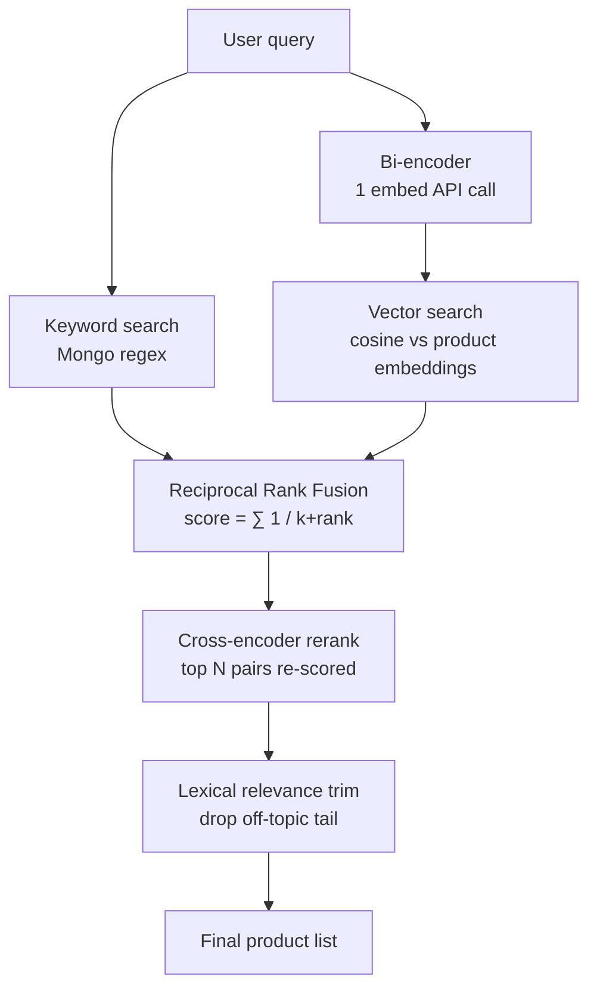
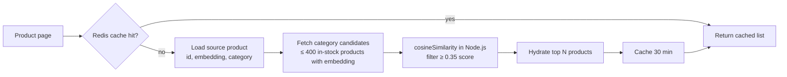
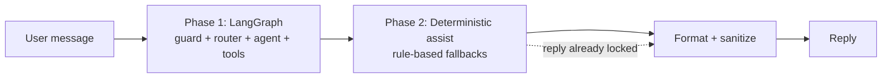
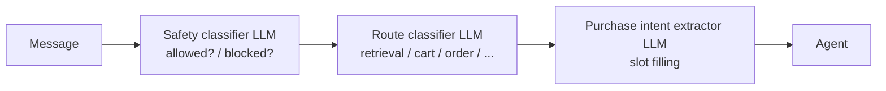
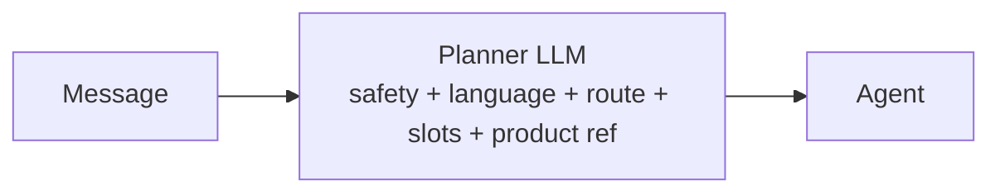
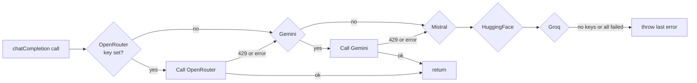
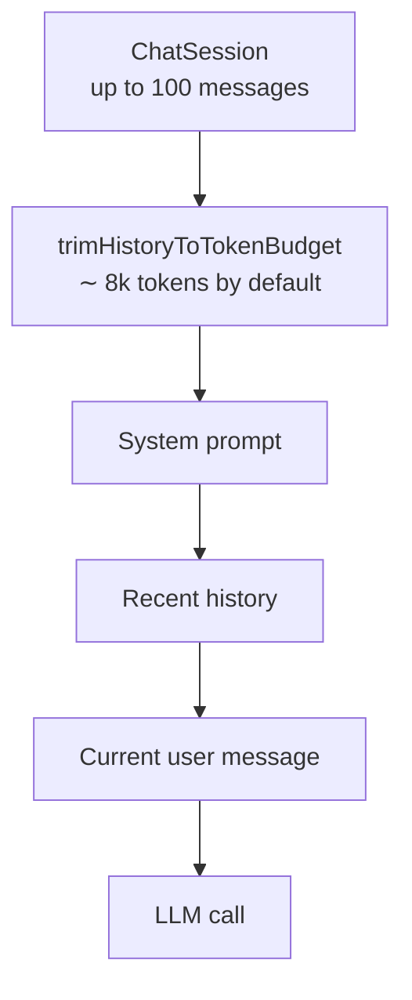

# ShopAI — Technical FAQ

Answers to "why did you build it *this* way?" for the choices that took the most
thought. Aimed at developers who want to understand or fork the codebase.

> Looking for setup instructions or a system overview? See
> [`docs/README.md`](./README.md). Looking for prioritized issues? See
> [`docs/AUDIT_BACKLOG.md`](./AUDIT_BACKLOG.md).

---

## Table of contents

1. [Why hybrid search (bi-encoder + RRF + reranker) instead of pure vector search?](#1-why-hybrid-search-bi-encoder--rrf--reranker-instead-of-pure-vector-search)
2. [Why simple local cosine for the "similar products" section on the PDP?](#2-why-simple-local-cosine-for-the-similar-products-section-on-the-pdp)
3. [Why LangGraph + a deterministic assist layer (two phases)?](#3-why-langgraph--a-deterministic-assist-layer-two-phases)
4. [Why one planner LLM call instead of the older classifier + router + extractor chain?](#4-why-one-planner-llm-call-instead-of-the-older-classifier--router--extractor-chain)
5. [Why multi-provider LLM fallback (OpenRouter → Gemini → Mistral → HF → Groq)?](#5-why-multi-provider-llm-fallback-openrouter--gemini--mistral--hf--groq)
6. [Why MongoDB (not Pinecone / Weaviate / Postgres+pgvector)?](#6-why-mongodb-not-pinecone--weaviate--postgrespgvector)
7. [Why Stripe-hosted checkout instead of a custom card form?](#7-why-stripe-hosted-checkout-instead-of-a-custom-card-form)
8. [Why BullMQ (optional) instead of a queue-first architecture?](#8-why-bullmq-optional-instead-of-a-queue-first-architecture)
9. [Why Server-Sent Events (SSE) for streaming instead of WebSockets?](#9-why-server-sent-events-sse-for-streaming-instead-of-websockets)
10. [Why session-scoped chat history + token-budget trimming?](#10-why-session-scoped-chat-history--token-budget-trimming)
11. [Why in-DB telemetry (Developer Analytics) instead of Prometheus / Datadog?](#11-why-in-db-telemetry-developer-analytics-instead-of-prometheus--datadog)
12. [Why "chat tool" telemetry as its own source in the same LlmUsageLog collection?](#12-why-chat-tool-telemetry-as-its-own-source-in-the-same-llmusagelog-collection)
13. [Why server-side tool argument sanitization for phone numbers?](#13-why-server-side-tool-argument-sanitization-for-phone-numbers)
14. [Why deterministic ordinal picks + `messageKind` instead of regex-parsing markdown?](#14-why-deterministic-ordinal-picks--messagekind-instead-of-regex-parsing-markdown)
15. [Why Redis is optional?](#15-why-redis-is-optional)

---

## 1. Why hybrid search (bi-encoder + RRF + reranker) instead of pure vector search?

**Short answer:** pure vector search alone is precision-poor for e-commerce
queries; hybrid search recovers precision without giving up recall.

### The problem with each strategy on its own

| Strategy | Strength | Failure mode |
|---|---|---|
| **Keyword** (regex on name/desc/tags) | Exact matches are perfect | "sneakers" won't find a product tagged only "running shoes" |
| **Bi-encoder only** (embed query, cosine vs product) | Understands synonyms and intent | Semantically-similar-but-off-topic items leak in ("cricket helmet" for "cricket bat") |
| **Cross-encoder only** (re-score every pair) | Best ranking quality | Too slow to score the full catalog per query |

### How ShopAI combines them



- **RRF** (Reciprocal Rank Fusion) merges two ranked lists fairly — neither
  keyword nor vector can dominate. Very cheap: no learned weights to tune.
- **Cross-encoder rerank** is only asked to score the top ~30 candidates (paid
  API call but bounded).
- **Lexical trim** enforces "if none of the top's words appear in the item, drop
  it". Kills the "3 good then 9 unrelated" tail that pure vector suffers from.

### Why *this* order

- **RRF before rerank:** the reranker sees a better shortlist → fewer API calls,
  better ranking.
- **Trim after rerank:** the reranker sometimes rescues semantically-similar
  neighbours the keyword pass wouldn't have found; the trim then removes items
  that lost the lexical anchor entirely.

### When we'd switch

If we ever ran on a domain where synonym recall matters more than lexical
precision (e.g. long-form Q&A), we'd drop the trim step and rely more on
cross-encoder confidence. For e-commerce ("show me cricket bats"), lexical
grounding is worth its weight in gold.

See: `Backend/services/search/searchService.js`, `productSearch.js`.

---

## 2. Why simple local cosine for the "similar products" section on the PDP?

**Short answer:** the section only needs 8 items from the same category, so
Atlas `$vectorSearch` is overkill and costs Search Nodes minutes we don't have
on free/small tiers.



### Trade-offs vs Atlas `$vectorSearch`

| | Simple local cosine | Atlas $vectorSearch |
|---|---|---|
| Cost | $0 (Node CPU only) | Search node minutes (paid) |
| Latency (typical) | 20-80 ms for < 400 candidates | 30-100 ms |
| Scales to 100k+ items | No — pool gets too big | Yes (ANN) |
| Filters (in-stock, category) | Cheap Mongo filter first | Filter path can be slow on Atlas Free |

### Why 400 candidates is enough

Category filter typically leaves 50–300 items. If a store grows to 100k+ per
category, they can switch by setting `SIMILAR_PRODUCTS_MODE=atlas`. The Atlas
path is preserved as an opt-in behind that flag.

**Cache:** 30-minute Redis cache per (productId, limit) — invalidated
implicitly when the TTL expires (product embeddings don't change between
edits, and stale results are non-critical).

See: `Backend/services/similarProductsService.js`.

---

## 3. Why LangGraph + a deterministic assist layer (two phases)?

**Short answer:** LLMs are creative but forgetful. LangGraph gives us
structured, testable routing; the deterministic assist catches the "the agent
forgot to call the tool" cases without a second LLM.



### What each phase does

- **Phase 1** is the "conversation layer". The agent has full LLM freedom to
  pick tools, format prose, use language X, etc.
- **Phase 2** is a set of small rule-based modules that fire only when the
  agent misses something obvious:
  - You said "add it to cart" but the agent forgot to call `add_to_cart` →
    cartAssist runs it.
  - You pasted an address but the agent didn't call `add_shipping_address` →
    addressAssist parses and saves it.
  - The reranked search list didn't show up in the reply → retrievalAssist
    injects it.

### Why not just re-prompt the LLM?

- Cost: a second LLM call every turn doubles token spend.
- Latency: users notice a 2× round trip.
- Determinism: rule-based paths never hallucinate; they either match or
  don't.

### Why the reply-lock?

Certain assists produce authoritative content (e.g. "product detail card
matched by ordinal"). Later assists must not overwrite them. Every assist
checks `state.replyLocked` before writing.

See: `Backend/services/chatDeterministicAssist.js` and its neighbours.

---

## 4. Why one planner LLM call instead of the older classifier + router + extractor chain?

**Short answer:** three sequential LLM calls per message cost 3× tokens and
3× latency. One structured call does the same job.

### Before (three calls)



### After (one call)



The planner returns a single JSON object:

```jsonc
{
  "allowed": true,
  "block_reason": null,
  "language": "te",
  "label": "Telugu",
  "script": "latin",
  "route": "product_detail",
  "product_ref": { "kind": "ordinal", "value": 2 }
}
```

### And a heuristic shortcut

For obviously English shopping queries (e.g. "show me cricket bats") a
heuristic short-circuits the LLM entirely and marks the route with high
confidence — zero LLM tokens spent on the router.

See: `Backend/services/chatGraph/guard.js`, `chatPlanner.js`,
`routerHeuristic.js`.

---

## 5. Why multi-provider LLM fallback (OpenRouter → Gemini → Mistral → HF → Groq)?

**Short answer:** free tiers rate-limit unpredictably; one provider going
down shouldn't take chat with it.



Each hop is skipped if the key isn't set, retried on the next on rate limit
or transport error, and logged to `LlmUsageLog` with the resulting
`errorType` so admins can see which providers are failing.

See: `Backend/services/llmService.js`.

---

## 6. Why MongoDB (not Pinecone / Weaviate / Postgres+pgvector)?

**Short answer:** one database that already stores products, orders, sessions,
and reviews is easier to run than four services for a hobby-scale project.

| Choice | Why it fits ShopAI |
|--------|--------------------|
| **MongoDB with embeddings on the Product doc** | One roundtrip fetches the product + its vector. No cross-service consistency to worry about. |
| **Atlas $vectorSearch (opt in)** | When the catalog outgrows local cosine, the same document layout can be used with the paid Atlas Search feature — no re-embed. |
| **Local cosine fallback** | Works in dev, tests, and small stores without touching Atlas at all. |

### What we'd change at bigger scale

- Move embeddings into a separate collection (or Pinecone/Weaviate) once the
  Product doc + vector combined starts blowing past the 16 MB doc size.
- Add a sidecar indexing job that keeps the vector store in sync with product
  writes (currently `embeddingSyncQueue.js` handles missing ones at startup).

---

## 7. Why Stripe-hosted checkout instead of a custom card form?

**Short answer:** hosted checkout gets PCI compliance and 3-D Secure for free.
For a template that other people will fork, the fewer sensitive integrations
we own, the better.

- Card data never touches ShopAI servers.
- Server-side cart snapshot is created *before* the Stripe session, so the
  price the user pays cannot be tampered with client-side.
- `applyStripeCheckoutSession()` is the canonical order-creation path — the
  webhook, the "did my payment go through?" polling, and the manual
  verification endpoint all funnel through it, so an order can only be
  created once regardless of race conditions.

See: `Backend/services/orderCheckout.js`, `orderService.js`.

---

## 8. Why BullMQ (optional) instead of a queue-first architecture?

**Short answer:** BullMQ + Redis is the right choice for production, but many
deployments (learning, demoing, small stores) don't have Redis. Everything
degrades to in-process fallbacks.

| Job | With Redis (BullMQ) | Without Redis |
|-----|--------------------|---------------|
| Product tagging | Background worker | Fire-and-forget in API process |
| Embedding sync | Background worker (recommended in prod) | In-process on startup |
| Checkout expiry | Delayed job | Relies on Stripe webhook |
| Coupon cache bust | Precise at `startDate`/`endDate` | 120s TTL only |
| Chat eval suite | Queued, resumable | 400 error (Redis required) |
| LLM usage summary | Nightly aggregator | On-demand raw aggregation (slower for large windows) |

Each queue is guarded by a `is*QueueEnabled()` helper the app inspects
before scheduling.

See: `Backend/services/queueWorkers.js` and the individual `*Queue.js`
modules.

---

## 9. Why Server-Sent Events (SSE) for streaming instead of WebSockets?

**Short answer:** chat is a one-way stream (server → client). SSE runs over
plain HTTP, works through corporate proxies, doesn't need sticky sessions,
and reuses the same auth cookie the REST API uses.

Events the stream emits:

- `route` — which agent got picked (e.g. `checkout`)
- `tool_start` / `tool_end` — for tool status badges in the UI
- `text_delta` — token-by-token completion
- `done` — final structured response (cartSummary, checkout, etc.)
- `error` — surfaced with a stable code

The client is `EventSource`-friendly (see `Frontend/src/components/ChatBot/AssistantPage.js`),
which means retry-on-disconnect is handled by the browser for free.

---

## 10. Why session-scoped chat history + token-budget trimming?

**Short answer:** LLM context windows are limited and expensive; sessions
give a natural boundary; token-budget trimming keeps the tail useful.



- The oldest messages are dropped first to keep the recent context in view.
- `catalogProducts[]` on assistant messages preserves the products shown to
  the user even after the raw text is trimmed — this is how ordinal picks
  ("show me the second one") still work after 20 more messages.
- User has 50 sessions max; oldest are archived / trimmed when adding new
  ones.

See: `Backend/services/chatHistoryTrim.js`, `chatSessionService.js`,
`ChatSession.js`.

---

## 11. Why in-DB telemetry (Developer Analytics) instead of Prometheus / Datadog?

**Short answer:** ShopAI is meant to run on free / hobby tiers. Shipping
metrics out is expensive; the data we care about (LLM calls, cost, errors)
is already going into Mongo — surface it there.

```mermaid
flowchart LR
  APP[Chat / eval / tool calls] --> LOG[LlmUsageLog<br/>batched inserts 5s / 100 rows]
  LOG --> DAILY[LlmUsageSummary<br/>nightly aggregation]
  DAILY --> API[/analytics/chat-usage/]
  API --> UI[Developer Analytics UI]
  APP --> HEALTH[/analytics/system-health/<br/>Mongo + Redis + providers + queues]
  HEALTH --> UI
```

**What the Developer Analytics dashboard surfaces (all from Mongo):**

- **System health** — Mongo/Redis ping, provider keys configured, queue
  enablement, embedding coverage, memory, uptime, similar-products mode.
- **Chat usage** — token trend, cost estimate ($ per 1K tokens table),
  latency percentiles, error rate, top error types, per-route / per-provider
  / per-span breakdowns.
- **Chat tools** — per-tool call count, error rate, average latency.
- **Inference** — smoke-test each provider with a "Hi" prompt (also logged
  to `LlmUsageLog` as `source=inference_test` so tests don't skew production
  metrics).
- **Evaluate Chatbot** — golden test cases run through `runChatGraph()` with
  deterministic checks + LLM judge.

**Trade-offs vs Prometheus/Datadog:**

- Pros: zero extra infra; historical (90-day TTL) instead of a rolling
  window; searchable by session/request ID.
- Cons: no alerting; no distributed tracing across services; no per-node
  metrics (ShopAI is a single-process API anyway).

See: `Backend/services/llmUsageAnalytics.js`,
`Backend/services/systemHealthService.js`,
`Backend/services/llmPricing.js`.

---

## 12. Why "chat tool" telemetry as its own source in the same LlmUsageLog collection?

**Short answer:** we want per-tool dashboards without a second collection.

Tool invocations are recorded with `source: 'chat_tool'`, `tool: <name>`,
zero tokens, and a `success` flag. The Chat Usage panel filters by source
so dashboards stay clean; the Chat Tools panel filters *for* `chat_tool` to
build the per-tool table.

Alternative considered: separate `ToolUsageLog` model. Rejected because:

- The set of dimensions (route, requestId, session, latency, error) is the
  same.
- Filtering by `source` in aggregation is trivial and indexed.
- Fewer models = simpler ops.

See: `Backend/services/llmUsageLogger.js#recordChatToolUsage`,
`Backend/services/chatGraph/agentRunner.js`.

---

## 13. Why server-side tool argument sanitization for phone numbers?

**Short answer:** even with the strictest prompt, some models still invent
"9876543210" when a phone number is missing. Layered defenses beat trusting
a prompt.

**The chain of defenses:**

1. **Prompt engineering** — the checkout route prompt forbids inventing
   phone/PIN under a bold "HARD RULE".
2. **Tool schema `pattern`** — the JSON schema for `phone` requires a real
   Indian mobile format.
3. **Zod validation** in `addressService.validateAddressPayload`.
4. **Server-side sanitizer** (`toolArgSanitizer.js`) that strips
   `phone` from the tool call arguments when the value doesn't appear in
   either the current user text, recent history, or the user's profile
   phone — this catches the last-mile hallucination that slips through the
   prompt.

The sanitizer logs the strip so you can see it happening in
`LlmUsageLog` / server logs.

See: `Backend/services/chatGraph/toolArgSanitizer.js`.

---

## 14. Why deterministic ordinal picks + `messageKind` instead of regex-parsing markdown?

**Short answer:** the old approach (parse the previous assistant's markdown
to find products) broke every time the format changed. Persisting the
structured intent solves it once.

```mermaid
flowchart TB
  A[Assistant sends listing] --> PERSIST[Persist message with<br/>catalogProducts[] and messageKind='product_listing']
  U[User: 'tell me about the 2nd one'] --> LOOKUP[Find last message with<br/>messageKind='product_listing']
  LOOKUP --> ID[catalogProducts[1] &rarr; productId]
  ID --> TOOL[Call get_product_details]
```

`messageKind` also disambiguates the same ordinal across contexts:

- After `product_listing` → "the 2nd one" is a product pick.
- After `address_picker` → "the 2nd one" is a shipping address pick.

See: `Backend/model/ChatSession.js`,
`Backend/services/chatGraph/productContext.js`,
`Backend/controllers/chatCtrl.js#deriveMessageKind`.

---

## 15. Why Redis is optional?

**Short answer:** a new contributor should be able to `git clone`, set
`MONGO_URL` + `JWT_KEY` + one LLM key, and have chat working. Every
Redis-dependent feature has a graceful in-process fallback (see
[FAQ 8](#8-why-bullmq-optional-instead-of-a-queue-first-architecture)).

The tradeoff is minor: rate limits become per-process, catalog caches are
per-node, background jobs run in the API loop. In production those all
matter, so we recommend `REDIS_URL` + queue workers there.

See: `Backend/config/redisClient.js`, `Backend/services/cacheService.js`.

---

## Related reading

- [`docs/README.md`](./README.md) — architecture + setup guide
- [`Backend/docs/Chatbot.md`](../Backend/docs/Chatbot.md) — chat API & tools reference
- [`Backend/docs/Searchbox.md`](../Backend/docs/Searchbox.md) — hybrid search deep-dive
- [`Backend/docs/ProductTagging.md`](../Backend/docs/ProductTagging.md) — AI product tag pipeline
- [`Backend/docs/CommentTagging.md`](../Backend/docs/CommentTagging.md) — review moderation + tags
